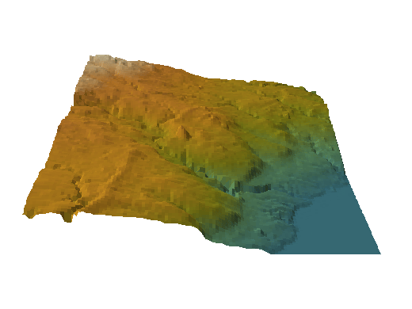

```{r setup, include=FALSE}
source("assets/theme_mikael.R")
ms_knitr_setup()
```

```{r libraries}
library(terra)
library(ggplot2)
library(dplyr)
library(tidyr)
library(patchwork)
library(leaflet)
library(gifski)
library(knitr)
```

```{r data}
dem      <- rast("DEM.tif")
dem_fill <- rast("Fill_DEM.tif")
twi_arc  <- rast("TWI.tif")
names(dem) <- "elevation"; names(dem_fill) <- "elevation"; names(twi_arc) <- "twi"

# Helpers: raster to data frame for ggplot
as_df <- function(r) as.data.frame(r, xy = TRUE, na.rm = TRUE)

# Hypsometric palette from low (blue-green) to high (sand), matched to the site
elev_cols <- c("#458592", "#689d6a", "#98971a", "#d79921", "#de8d32", "#f2e5bc")
twi_cols  <- c("#f2e5bc", "#d79921", "#689d6a", "#458592", "#2c3e64")

raster_map <- function() {
  list(
    coord_equal(expand = FALSE),
    theme_mikael(),
    theme(axis.text = element_blank(), axis.title = element_blank(), panel.grid = element_blank(),
          legend.key.height = unit(1.2, "cm"))
  )
}
```

## Overview

This project builds a **digital elevation model (DEM)** and a **Topographic Wetness Index (TWI)** for Mississauga, Ontario. TWI estimates where water tends to collect, from how much area drains into each cell and how steep that cell is:

$$\mathrm{TWI} = \ln\left(\frac{a}{\tan \beta}\right)$$

where $a$ is the upslope contributing area per unit contour width and $\beta$ is the local slope.

The original version (February 2024) plotted the DEM and perspective views in R, while the TWI was calculated separately in ArcGIS. This revision adds a hillshaded elevation map, a rotating 3D view, a look at what sink filling changed, and a TWI calculated entirely in R, compared against the ArcGIS result.

```{r data-table}
cell_m <- res(dem)[1]
ground_m <- cell_m * cos(43.59 * pi / 180)   # Web Mercator cells shrink by cos(latitude) on the ground
kable(
  data.frame(
    Layer = c("DEM.tif", "Fill_DEM.tif", "TWI.tif"),
    Description = c("Elevation (m)", "Elevation with sinks filled (ArcGIS)", "Topographic Wetness Index (ArcGIS)"),
    Size = sprintf("%d × %d cells", ncol(dem), nrow(dem)),
    `Cell size` = sprintf("%.0f m (≈ %.0f m on the ground)", cell_m, ground_m),
    check.names = FALSE
  ),
  caption = "Input rasters (WGS 84 / Pseudo-Mercator, EPSG:3857)"
)
```

## Elevation

```{r elevation-map, fig.height=8}
hill <- shade(terrain(dem, "slope", unit = "radians"), terrain(dem, "aspect", unit = "radians"),
              angle = 40, direction = 315)
names(hill) <- "hill"

ggplot() +
  geom_raster(data = as_df(dem), aes(x, y, fill = elevation)) +
  scale_fill_gradientn(colours = elev_cols, name = "Elevation (m)") +
  geom_raster(data = as_df(hill), aes(x, y, alpha = hill), fill = "#1d1b1a") +
  scale_alpha(range = c(0.45, 0), guide = "none") +
  labs(title = "Elevation of Mississauga", subtitle = "Hillshade from the northwest") +
  raster_map()
```

```{r elevation-summary}
ev <- values(dem, na.rm = TRUE)
kable(
  data.frame(
    Statistic = c("Minimum", "Mean", "Median", "Maximum", "Relief (max − min)"),
    `Elevation (m)` = sprintf("%.1f", c(min(ev), mean(ev), median(ev), max(ev), max(ev) - min(ev))),
    check.names = FALSE
  ),
  align = c("l", "r"), caption = "Elevation summary"
)
```

## Perspective Views

The surface is drawn with `persp()`, coloured by elevation, with vertical exaggeration so the gentle relief is visible.

```{r persp-setup}
# Downsample for drawing speed; persp() wants a matrix with x along rows
dem_small <- aggregate(dem, fact = 3, fun = "mean")
z <- t(as.matrix(dem_small, wide = TRUE))[, nrow(dem_small):1]
z[is.na(z)] <- min(z, na.rm = TRUE)

# Facet colours by mean elevation of each facet
zf <- (z[-1, -1] + z[-1, -ncol(z)] + z[-nrow(z), -1] + z[-nrow(z), -ncol(z)]) / 4
pal <- colorRampPalette(elev_cols)(100)
facet_col <- pal[cut(zf, 100, include.lowest = TRUE)]

draw_persp <- function(theta, phi = 30, main = NULL) {
  par(mar = c(0, 0, if (is.null(main)) 0 else 2, 0), bg = NA, col.main = ms_colours[["orange"]])
  persp(z, theta = theta, phi = phi, col = facet_col, border = NA, shade = 0.35,
        expand = 0.25, box = FALSE, scale = TRUE, ltheta = -120, main = main)
}
```

```{r persp-grid, fig.height=7, dpi=96}
par(mfrow = c(2, 2))
for (th in c(0, 45, 135, 225)) draw_persp(th, main = sprintf("θ = %d°", th))
```

### Rotating view

```{r rotation-gif, results="hide"}
# Revised from Perspective_Plot_Loop_to_Png_Code.txt: one frame per 6 degrees, saved as a GIF
frames_dir <- file.path(tempdir(), "persp_frames")
dir.create(frames_dir, showWarnings = FALSE)
angles <- seq(0, 354, by = 6)
frame_files <- sprintf("%s/frame_%03d.png", frames_dir, seq_along(angles))
for (i in seq_along(angles)) {
  png(frame_files[i], width = 520, height = 390, bg = "#242424")
  draw_persp(angles[i], phi = 28)
  dev.off()
}
gifski(frame_files, gif_file = "DEM_rotation.gif", width = 520, height = 390, delay = 0.09)
```



## Filling Sinks

Before calculating flow, small pits in a DEM (often artefacts of the data) are filled so water can keep moving downhill. Comparing the two DEMs shows how much the fill changed.

```{r sink-histograms, fig.height=4.5}
hist_df <- bind_rows(
  data.frame(elevation = values(dem, na.rm = TRUE)[, 1], dem = "Original DEM"),
  data.frame(elevation = values(dem_fill, na.rm = TRUE)[, 1], dem = "Filled DEM")
)

ggplot(hist_df, aes(x = elevation, fill = dem)) +
  geom_histogram(binwidth = 2, position = "identity", alpha = 0.6, colour = NA) +
  scale_fill_manual(values = c("Original DEM" = ms_colours[["blue"]], "Filled DEM" = ms_colours[["orange"]]),
                    name = NULL) +
  labs(title = "Elevation distribution, before and after filling sinks",
       x = "Elevation (m)", y = "Number of cells") +
  theme_mikael() +
  theme(legend.position = "top", legend.justification = "left")
```

```{r fill-depth-map, fig.height=8}
fill_depth <- dem_fill - dem
names(fill_depth) <- "depth"
fd <- as_df(fill_depth)

ggplot() +
  geom_raster(data = as_df(hill), aes(x, y, alpha = hill), fill = "#8c8577") +
  scale_alpha(range = c(0.5, 0.05), guide = "none") +
  geom_raster(data = filter(fd, depth > 0.01), aes(x, y, fill = depth)) +
  scale_fill_gradientn(colours = c("#d79921", "#d62221", "#8f3f71"), name = "Fill depth (m)",
                       trans = "sqrt") +
  labs(title = "Where sinks were filled",
       subtitle = sprintf("%.1f%% of cells raised; deepest fill %.1f m",
                          100 * mean(fd$depth > 0.01), max(fd$depth))) +
  raster_map()
```

## Topographic Wetness Index

### Calculated in R

The TWI is calculated from the filled DEM in a projected coordinate system (NAD83 / UTM zone 17N), so cell sizes are true ground distances:

1. D8 flow direction from the filled DEM
2. Flow accumulation (number of upslope cells)
3. Specific catchment area $a$ = (accumulation + 1) × cell size
4. Slope $\beta$, with a small minimum so flat cells don't divide by zero
5. TWI = ln(a / tan β)

```{r twi-r}
fill_utm <- project(dem_fill, "EPSG:26917", method = "bilinear", res = 70)
flowdir  <- terrain(fill_utm, "flowdir")
acc      <- flowAccumulation(flowdir)
slope    <- terrain(fill_utm, "slope", unit = "radians")
cell     <- res(fill_utm)[1]

sca     <- (acc + 1) * cell
twi_r   <- log(sca / tan(max(slope, 0.001)))
names(twi_r) <- "twi"

# Back to the original grid for comparison with the ArcGIS layer
twi_r_3857 <- project(twi_r, twi_arc, method = "bilinear")
```

```{r twi-maps, fig.height=7}
twi_scale <- scale_fill_gradientn(colours = twi_cols, name = "TWI", limits = c(2, 16), oob = scales::squish)

p_r <- ggplot(as_df(twi_r_3857), aes(x, y, fill = twi)) + geom_raster() + twi_scale +
  labs(title = "TWI calculated in R") + raster_map()
p_arc <- ggplot(as_df(twi_arc), aes(x, y, fill = twi)) + geom_raster() + twi_scale +
  labs(title = "TWI from ArcGIS") + raster_map()

(p_r | p_arc) +
  plot_layout(guides = "collect") +
  plot_annotation(theme = theme(plot.background = element_rect(fill = "transparent", colour = NA))) &
  theme(legend.position = "right")
```

### Comparison with the ArcGIS TWI

```{r twi-compare, fig.height=5}
both <- as.data.frame(c(twi_r_3857, twi_arc), na.rm = TRUE)
names(both) <- c("r", "arc")
# The ArcGIS layer stores some cells (mostly along edges) as exactly 0; treat those as no data
n_zero <- sum(both$arc == 0)
both <- filter(both, arc > 0)
r_corr <- cor(both$r, both$arc)

ggplot(both, aes(x = arc, y = r)) +
  geom_bin2d(bins = 70) +
  scale_fill_gradient(low = "#45859255", high = ms_colours[["orange"]], trans = "log10", name = "Cells") +
  geom_abline(slope = 1, intercept = 0, colour = ms_colours[["red"]], linetype = "dashed") +
  labs(title = "R TWI vs ArcGIS TWI, cell by cell",
       subtitle = sprintf("Pearson r = %.2f; dashed line is a perfect match; %s zero-valued ArcGIS cells excluded",
                          r_corr, format(n_zero, big.mark = ",")),
       x = "ArcGIS TWI", y = "R TWI") +
  coord_equal() +
  theme_mikael()
```

```{r twi-table}
kable(
  data.frame(
    Layer = c("TWI (R)", "TWI (ArcGIS)"),
    Min = sprintf("%.2f", c(min(both$r), min(both$arc))),
    Mean = sprintf("%.2f", c(mean(both$r), mean(both$arc))),
    Max = sprintf("%.2f", c(max(both$r), max(both$arc)))
  ),
  align = c("l", "r", "r", "r"), caption = "TWI summary on the shared grid"
)
```

Differences between the two come mainly from flow-routing details (ArcGIS and `terra` treat flat areas and edges differently) and from reprojecting between Web Mercator and UTM.

## Interactive Map

Switch between the layers with the control in the top right.

```{r leaflet}
elev_pal <- colorNumeric(elev_cols, values(dem), na.color = "transparent")
twi_pal  <- colorNumeric(twi_cols, c(2, 16), na.color = "transparent")
twi_r_clamped <- clamp(twi_r_3857, 2, 16)

leaflet(width = "100%", height = 560) %>%
  addProviderTiles(providers$CartoDB.Positron, group = "Light basemap") %>%
  addProviderTiles(providers$CartoDB.DarkMatter, group = "Dark basemap") %>%
  addRasterImage(dem, colors = elev_pal, opacity = 0.8, group = "Elevation", project = FALSE) %>%
  addRasterImage(twi_r_clamped, colors = twi_pal, opacity = 0.85, group = "TWI (R)", project = FALSE) %>%
  addLegend("bottomright", pal = elev_pal, values = values(dem), title = "Elevation (m)", group = "Elevation") %>%
  addLegend("bottomleft", pal = twi_pal, values = c(2, 16), title = "TWI", group = "TWI (R)") %>%
  addLayersControl(baseGroups = c("Light basemap", "Dark basemap"),
                   overlayGroups = c("Elevation", "TWI (R)"),
                   options = layersControlOptions(collapsed = FALSE)) %>%
  hideGroup("TWI (R)")
```

---

*Elevation data and the ArcGIS sink fill and TWI layers were prepared by Mikael Syed in ArcGIS (2024). TWI in R uses the `terra` package.*
